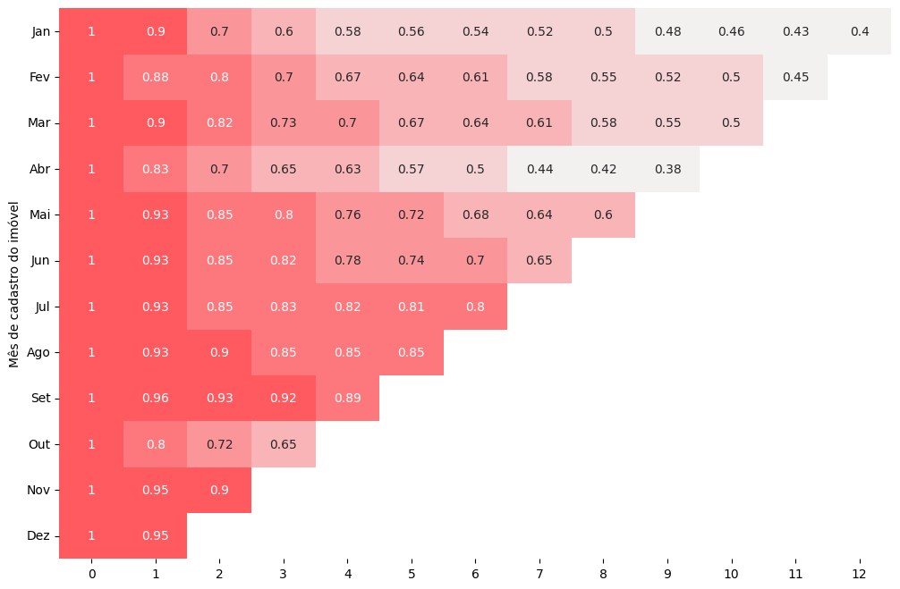
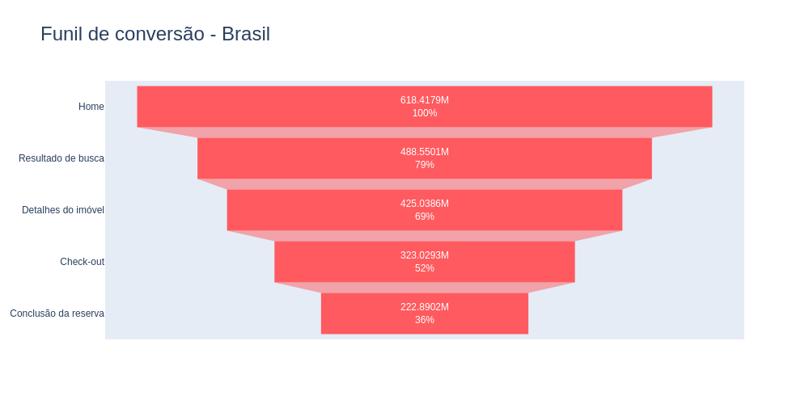

# Airbnb

## 📌 Visão Geral

Este projeto visa análisar os dados dos quatro principais países da América Latina: Argentina, Brasil, Colômbia e México, com o intuito de identificar tendências que possam infuenciar a quantidade de diárias reservadas.

Com os dados disponibilizados, foram feitas pelo python as seguintes análises: análise exploratória de dados, análise cohort e funil de conversão.

## 💼 Entendimento do Negócio

O Airbnb nasceu em 2007, quando dois anfitriões receberam três hóspedes em sua casa em São Francisco. Hoje, em 2024, a plataforma conta com **4 milhões de anfitriões que já receberam mais de 1,5 bilhão de hóspedes em quase todos os países do mundo**. Todos os dias, os anfitriões oferecem acomodações e experiências únicas que possibilitam que os viajantes conheçam outras comunidades de uma forma mais autêntica.

O Airbnb é uma plataforma que permite as pessoas alugar todo ou parte de sua casa, como uma forma de acomodação extra. O site fornece uma plataforma de busca e reservas entre a pessoa que oferece a acomodação e o turista que busca pela locação.

**Principal Indicador Chave de Desempenho (KPI)**

- Faturamento total

    Saber a saúde financeira da empresa é vital para o bom funcionamento dos negócios. E um dos principaís KPIs de uma empresa é seu faturamento.

    Para fazer uma análise mais profunda com os dados que temos, iremos ver o faturamento total de cada país, assim como as médias por acomodação e quantidade de reservas.

## 📊 Análise exploratória de dados

[📙 Notebook - Análise exploratória de dados](<Analise Exploratoria de Dados.ipynb>)

Com a análise realizada, foi possivel tirar os seguintes insights:

- A Argentina compensa a baixa quantidade de acomodações e reservas com a alta média de preço e alta classificação possuindo o maior faturamento por reservas, uma explicativa seria **os destinos terem uma sazonalidade menor, causando um baixo número de reservas e porém maior demanda e preço**.

- O Brasil possui o maior número de acomodações, reservas, faturamento total e variação de preço, **apresentando uma maior opção de destinos e preços para os diferentes tipos de público**.

- O México com sua baixa quantidade de acomodações tem o maior número de reservas e faturamento por acomodação, o que pode ser um **mercado potencial para adquirir novos acomodações**.

Entretanto, a Colômbia com o segundo maior número de acomodações e a menor média de preços possui o menor faturamento total e uma baixa procura de reservas por acomodação. Poderiamos fazer **uma análise mais profunda com nossos anfitriões** ou **averiguar causas externas como a segurança e acessibilidade.**

## 😄 Análise Cohort

[📙 Notebook - Análise Cohort](<Analise Cohort.ipynb>)

A Análise Cohort nos mostraram as taxas de retenção durante o periodo de um ano.

Ao fazer uma breve análise, podemos concluir que apesar de termos melhoras na taxa de retenção ao passar dos mêses, os periodos de Abril e Outubro apresentaram quedas bruscas de retenção após os primeiro mês. É necessario uma averiguação mais completa nesses meses para saber suas causas.

## 🔻 Funil de Conversão

[📙 Notebook - Funil de conversão](<Funil de Conversao.ipynb>)

Foram criado os funis de conversão para os 4 países e foi observado que:

- Perdemos muitos usuários nas etapas iniciais de busca e detalhes de imóveis, indicando que há melhorias a serem feitas em nosso sistema de busca.

- O Brasil apresenta a maior dataxa de conversão.

- A Argentina e a Colômbia apresentam a pior taxa de conversão.

## ✅ Conclusão

Apesar do dataset limitado que nos foi disponibilizado, conseguimos extrair insights valiosos sobre as características de hospedagem dos quatro países.

Todos os insights e gráficos podem ser encontrados nos notebooks do projeto.